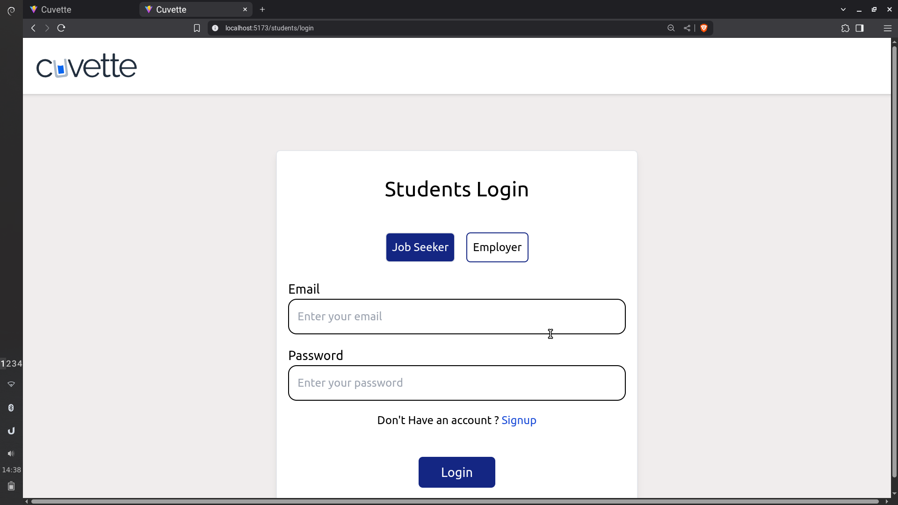
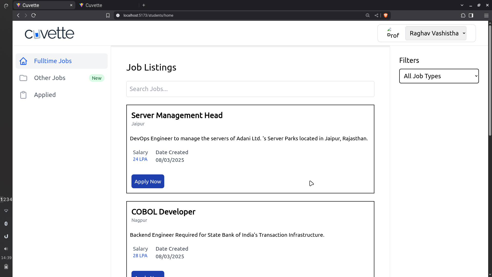
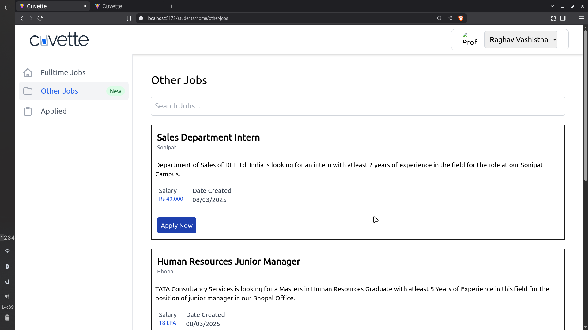
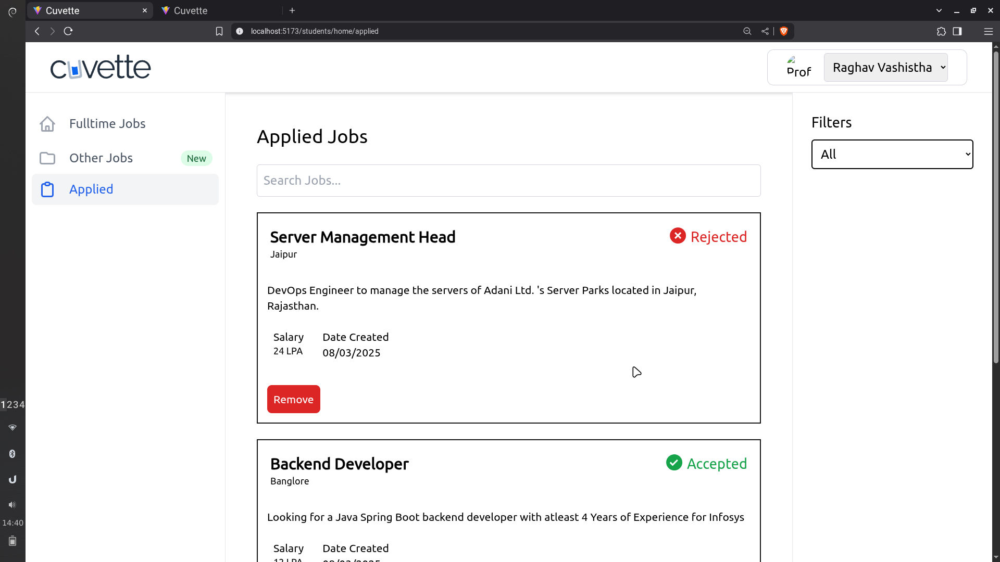
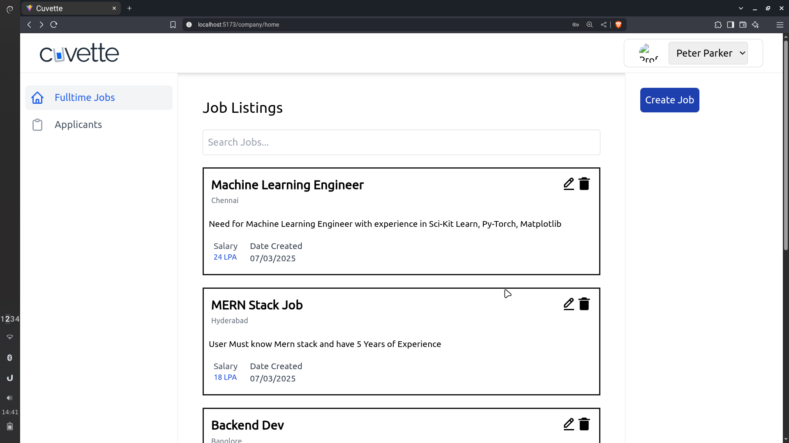
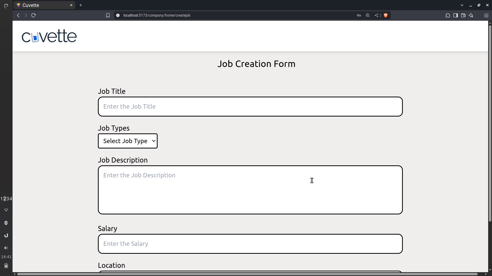
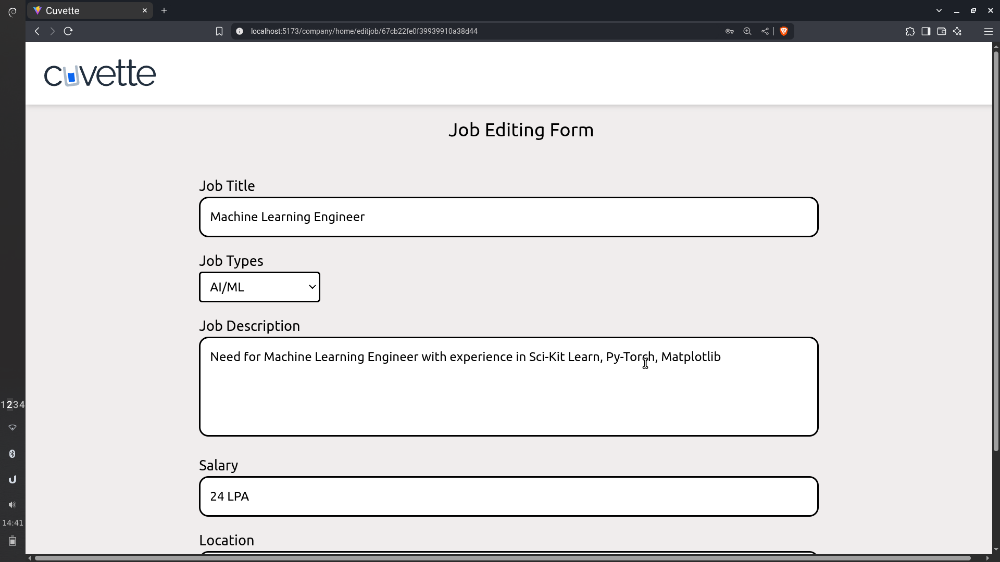
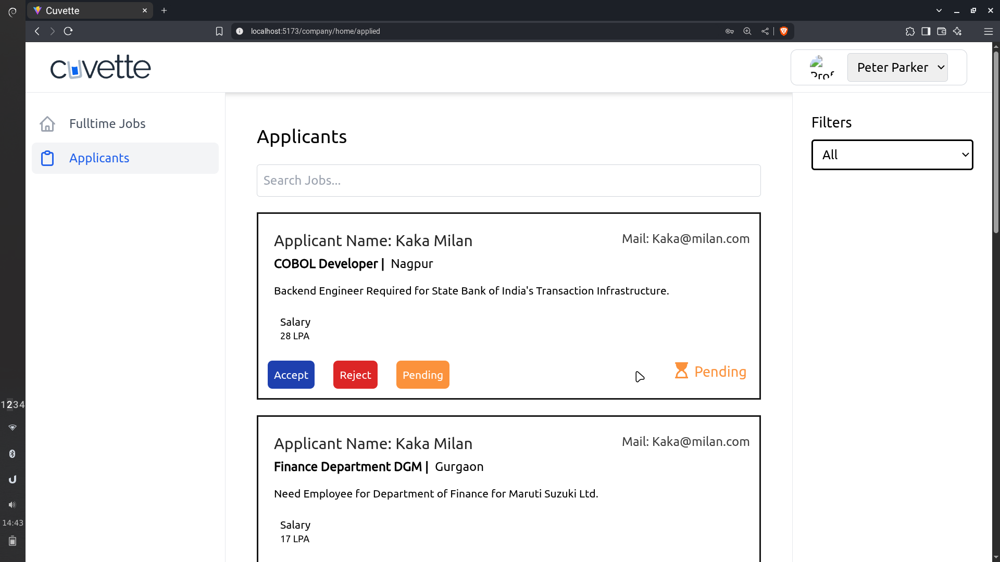

# Cuvette Clone – MERN Stack Job Portal
A fully functional **Cuvette** clone built with the **MERN stack** and styled using **Tailwind CSS**. It supports two types of users, offers robust authentication, and enables seamless job listings, applications, and management.

## Features
**General**
- Built with **MongoDB, Express.js, React.js, Node.js**
- Modern, responsive UI using **Tailwind CSS**
- **Role-based authentication** (JWT + salted passwords)
- **Session management with cookies:** secure login, prevent unauthorized access

**Employer Functionality**
- Register & Login as an employe
- **Post jobs** using a form with fields: title, description, salary, location, date.
- **Edit** or **delete** existing job listings
- **View list of applicants** for each job
- **Category selection** (e.g., AI/ML, DevOps   , etc.)
- **Search, filter, and manage** jobs easily

**Employee (Job Seeker)**
- Register & login as job seeker
- **View & search job listings** by title, type, location, salary, and category
- **Apply to jobs**; track applied jobs and see application statuses (Accepted/Rejected)
- **Remove applications** from history
- Browse **Fulltime Jobs**, **Other Jobs** (by category), and **Applied** section

**Security**
- Passwords hashed and salted before storage
- JWT auth for all protected routes
- **Cookie-based** session tokens expire on logout

## Screenshots
- Home page

- Login

 

##  Students Section

- Students Home Page

 

 -Other Jobs page

 

- Applied Jobs Page

 

## Employer Section

- Employer Home Page

 

- Job Creation Form

 

- Job Editing Form

 

- Applicants page

 

## ⚙️ Tech Stack

| Layer      | Technology        |
|------------|------------------|
| Frontend   | React.js, Tailwind CSS |
| Backend    | Node.js, Express.js    |
| Database   | MongoDB           |
| Auth       | JWT, bcrypt (salted)   |

## Setup Instructions

1. Copy `.env.example` to `.env` in `/server/` and `/User/`
2. Fill in the required credentials like Mongo URI, JWT secret, etc.
3. Run the backend: `npm run server`
4. Run the frontend: `npm run dev` inside `/User/`
