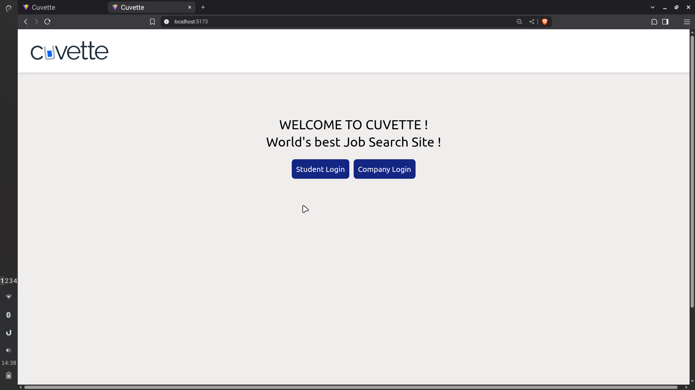

# Cuvette Clone – MERN Stack Job Portal
A fully functional **Cuvette** clone built with the **MERN stack** and styled using **Tailwind CSS**. It supports two types of users, offers robust authentication, and enables seamless job listings, applications, and management.

## Features
**General**
- Built with **MongoDB, Express.js, React.js, Node.js**
- Modern, responsive UI using **Tailwind CSS**
- **Role-based authentication** (JWT + salted passwords)
- **Session management with cookies:** secure login, prevent unauthorized access

**Employer Functionality**
- Register & Login as an employe
- **Post jobs** using a form with fields: title, description, salary, location, date.
- **Edit** or **delete** existing job listings
- **View list of applicants** for each job
- **Category selection** (e.g., AI/ML, DevOps   , etc.)
- **Search, filter, and manage** jobs easily

**Employee (Job Seeker)**
- Register & login as job seeker
- **View & search job listings** by title, type, location, salary, and category
- **Apply to jobs**; track applied jobs and see application statuses (Accepted/Rejected)
- **Remove applications** from history
- Browse **Fulltime Jobs**, **Other Jobs** (by category), and **Applied** section

**Security**
- Passwords hashed and salted before storage
- JWT auth for all protected routes
- **Cookie-based** session tokens expire on logout

## Screenshots
- Home page



- Login

 

##  Students Section

- Students Home Page

 

 -Other Jobs page

 

- Applied Jobs Page

 

## Employer Section

- Employer Home Page

 

- Job Creation Form

 

- Job Editing Form

 

- Applicants page

 

## ⚙️ Tech Stack

| Layer      | Technology        |
|------------|------------------|
| Frontend   | React.js, Tailwind CSS |
| Backend    | Node.js, Express.js    |
| Database   | MongoDB           |
| Auth       | JWT, bcrypt (salted)   |


## Setup Instructions

Follow these steps to run the project on your local machine.

### 1. Prerequisites

Before you begin, make sure you have installed the following tools:

- [Node.js](https://nodejs.org/) (v18 or later recommended)
- [npm](https://www.npmjs.com/) (usually comes with Node.js)
- [MongoDB](https://www.mongodb.com/try/download/community) (local or use [MongoDB Atlas](https://www.mongodb.com/cloud/atlas))
- [Git](https://git-scm.com/)

---

### 2. Clone the Repository

Open your terminal and run:
git clone https://github.com/your-username/your-repo-name.git
cd your-repo-name


---

### 3. Set Up Environment Variables

1. Navigate to the `backend` directory.
2. Create a `.env` file:

    ```
    cd server/
    touch .env
    ```

3. Add these lines to your `.env` file (replace the placeholders with your actual credentials):

    ```
    MONGO_URI=your_mongodb_connection_string
    JWT_SECRET=your_jwt_secret_key
    ```

---

npm install
npm start

- The backend should now be running (by default on port 5000).

---

### 5. Install and Run the Frontend

1. Open a new terminal window or tab.
2. Navigate to the `frontend` directory and run:

    ```
    cd User/
    npm install
    npm start
    ```
- The frontend should now be running at [http://localhost:5173](http://localhost:5173).

---

### 6. Using the Application

- Open your browser and go to [http://localhost:5173](http://localhost:5173).
- Register as an employer or employee to explore all the features.

---

### 💡 Troubleshooting & Tips

- If you see a "port already in use" error, either stop the other app using that port or change the port in your `.env`.
- Never commit your `.env` to a public repository—keep it private!
- For a free database, consider using [MongoDB Atlas](https://www.mongodb.com/cloud/atlas).
- For issues or help, open an issue on GitHub.

---


